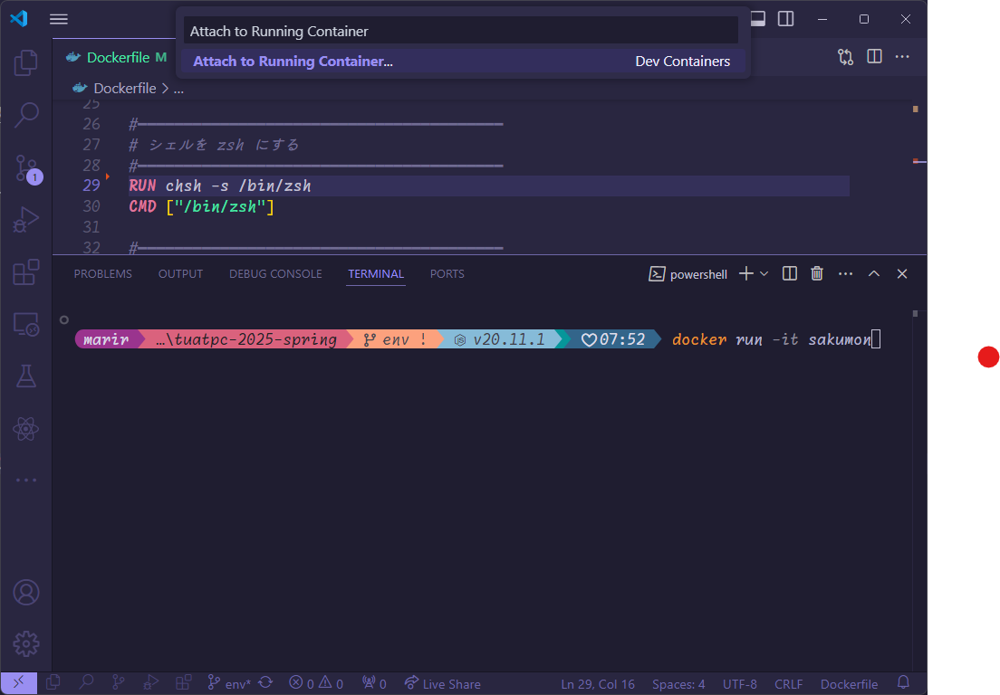

# Docker の使い方

詳しい人、追記してくれ！

## Docker のインストール

以下を参考に頑張ってインストールしてください。
- https://www.google.com/search?client=firefox-b-d&q=Docker+%E3%82%A4%E3%83%B3%E3%82%B9%E3%83%88%E3%83%BC%E3%83%AB

## Docker イメージの作成

クローンしたこのリポジトリで以下のコマンドを実行してください。

```
docker build -t sakumon .
```

これでイメージが作成されます。
以下のコマンドで実行されます。

```
docker create -it sakumon
docker start <container-id>
```

`<container-id>` には `docker create -it sakumon` の実行時に表示された ID を入力してください。 `docker ps -a` などでも確認できると思います。
この状態で VSCode の左下をクリックして、Docker コンテナを VSCode で開いてください。



これで VSCode 上でいい感じに作業できます。
以降は VSCode のスタートページから起動すればいい感じに起動できると思います。
